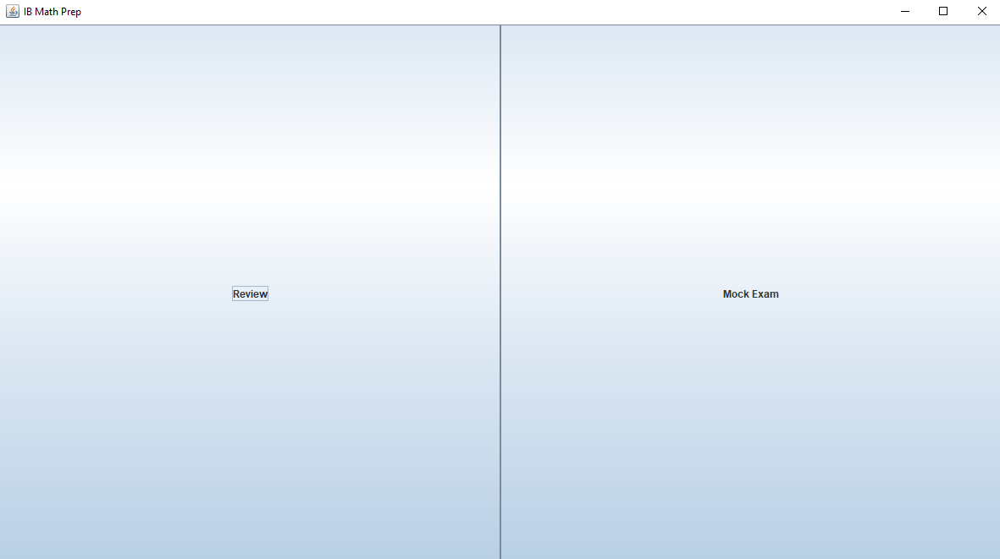
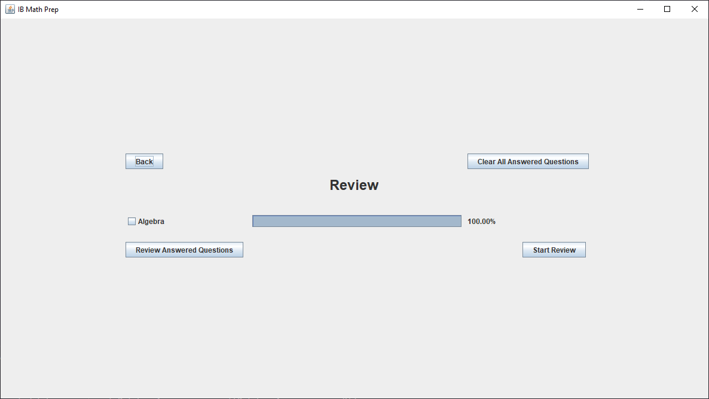
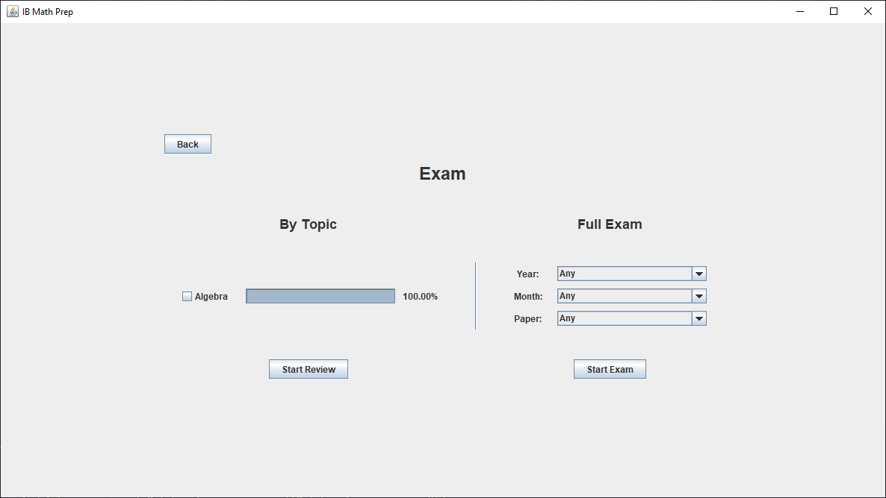

# IB Math Prepper

## Introduction
This program, created in January 2020, was designed for creating a platform where the user can load up certain practice question and answer sets to practice for the IB Mathematics SL/HL exams.

## Usage
## Connect to Database (Defunct)
This would previously try to connect to an online database to retrieve prestored questions and answers for this prep program. This however is now no longer functional as the database has been deleted.

    

## Failed to Connect
In the event that a database connection could not be established, you would receive this screen. Continuing through the program without a database connection would result it in loading up a offline environment with one review question and one test exam.

    

## Main Menu
This is the main menu, where you would be given the choice between Review or Mock Exam. The main difference in review is that you would be able to select the specific topic that you would want to review compared in the mock exam, where it would give you all the questions within that specific mock exam.

    

## Review Section
In this section, you would be able to enable or disable checkboxes to indicate which topics you would like to review. Additionally, the IB exam prepper would also store any previously entered answers to any of the questions provided. This way, you can also access and review previously answered questions to check for correctness or just to check how questions would be solved.

    

## Exam Section
In the exam section, you can also review by topic, but this time it would only get questions that are within specific exams that you can specify in the dropdown boxes to the right. Additionally, you can choose to start a mock exam using a past IB exam with those dropdown boxes.

    

## Question Page
Here is the question page. In this page, to the right, you can navigate between the different questions that has been selected in the previous menus. To the right, you can see the main question, where a timer is included and you can choose to start or stop it by clicking on the timer. Additionally you have the answering field down below which allows you to input an answer using both normal english and LaTeX with full mathematical notation.

    

Here you can see the LaTeX input panel which allows users to enter correct mathematical notation without needing the knowledge on how LaTeX works.

    

And here, you would be able to preview your inputted answer to check if the answer you typed out in LaTeX is the correct answer you want to store.

    

## Revision / Answers Page
Finally we have the answers page. In this page, you can see your previously answered questions on the right. This includes all the answers you have inputted before, such as if you answered this "Test Algebra Question" twice, two instances of it would show up on the right. Then, you can review the question and what you have inputted as your answer. You can also scroll farther down to see the answer and explanation to how to solve that specific question.

    

